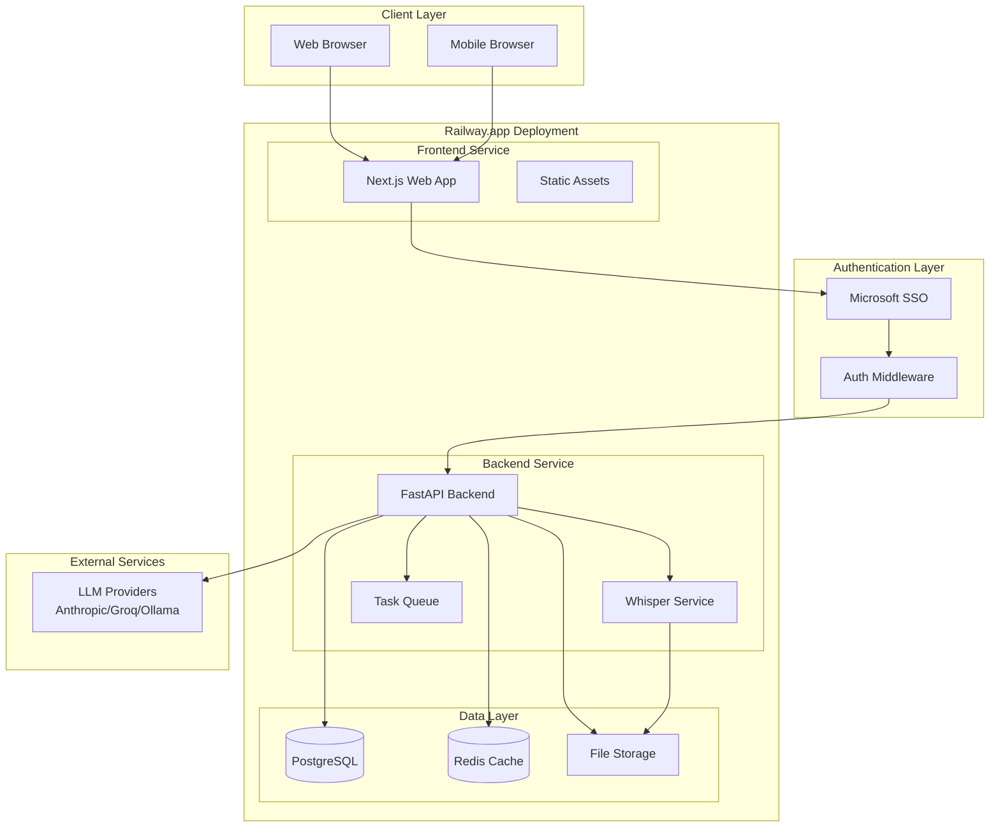
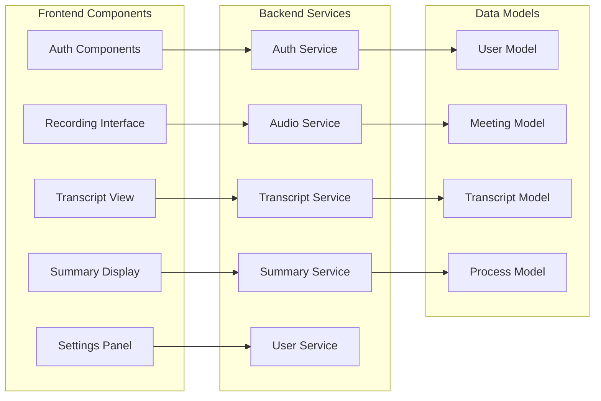

# Design Document

## Overview

This document outlines the design for transforming the existing Meetily desktop application into a cloud-hosted web application deployed on Railway.app with Microsoft SSO authentication. The redesign maintains the core meeting transcription and summarization functionality while transitioning from a local Tauri-based desktop app to a scalable, multi-tenant web application.

The current architecture consists of a Tauri frontend with Next.js, a Python FastAPI backend, local Whisper transcription, and SQLite database. The new architecture will feature a Next.js web application, enhanced FastAPI backend with authentication middleware, PostgreSQL database, cloud-based audio processing, and secure file storage.

## Architecture

### High-Level Architecture



### Component Architecture



## Components and Interfaces

### Frontend Components

#### Authentication Components
- **LoginPage**: Microsoft SSO integration with redirect handling
- **AuthProvider**: React context for authentication state management
- **ProtectedRoute**: Route wrapper for authenticated access
- **UserProfile**: User information and logout functionality

#### Core Application Components
- **Dashboard**: Main landing page with meeting list and quick actions
- **RecordingInterface**: Audio upload and real-time processing status
- **TranscriptViewer**: Display and edit transcript content
- **SummaryDisplay**: AI-generated summary with regeneration options
- **MeetingList**: User's meeting history with search and filtering
- **SettingsPanel**: Model configuration and user preferences

#### Shared Components
- **LoadingSpinner**: Consistent loading indicators
- **ErrorBoundary**: Error handling and display
- **NotificationSystem**: Toast notifications for user feedback
- **FileUploader**: Drag-and-drop audio file upload

### Backend Services

#### Authentication Service
```python
class AuthService:
    async def verify_microsoft_token(self, token: str) -> UserInfo
    async def create_user_session(self, user_info: UserInfo) -> Session
    async def validate_session(self, session_token: str) -> User
    async def revoke_session(self, session_token: str) -> bool
```

#### Audio Processing Service
```python
class AudioService:
    async def upload_audio(self, file: UploadFile, user_id: str) -> str
    async def process_audio(self, file_path: str, user_id: str) -> ProcessingJob
    async def get_processing_status(self, job_id: str) -> ProcessingStatus
    async def transcribe_audio(self, audio_path: str) -> TranscriptionResult
```

#### Meeting Management Service
```python
class MeetingService:
    async def create_meeting(self, user_id: str, title: str) -> Meeting
    async def get_user_meetings(self, user_id: str) -> List[Meeting]
    async def update_meeting(self, meeting_id: str, user_id: str, data: dict) -> Meeting
    async def delete_meeting(self, meeting_id: str, user_id: str) -> bool
```

#### Summary Service
```python
class SummaryService:
    async def generate_summary(self, transcript: str, user_id: str, config: ModelConfig) -> ProcessingJob
    async def get_summary_status(self, job_id: str, user_id: str) -> SummaryStatus
    async def regenerate_summary(self, meeting_id: str, user_id: str) -> ProcessingJob
```

### API Endpoints

#### Authentication Endpoints
- `POST /auth/microsoft/callback` - Handle Microsoft SSO callback
- `POST /auth/logout` - Invalidate user session
- `GET /auth/me` - Get current user information

#### Meeting Management Endpoints
- `GET /api/meetings` - Get user's meetings (with user isolation)
- `POST /api/meetings` - Create new meeting
- `GET /api/meetings/{meeting_id}` - Get specific meeting
- `PUT /api/meetings/{meeting_id}` - Update meeting
- `DELETE /api/meetings/{meeting_id}` - Delete meeting

#### Audio Processing Endpoints
- `POST /api/audio/upload` - Upload audio file
- `GET /api/audio/status/{job_id}` - Get processing status
- `POST /api/transcripts/process` - Process transcript for summary

#### Configuration Endpoints
- `GET /api/config/models` - Get available models
- `POST /api/config/models` - Save model configuration
- `GET /api/config/user` - Get user preferences

## Data Models

### User Model
```python
class User(BaseModel):
    id: str
    microsoft_id: str
    email: str
    name: str
    tenant_id: str
    created_at: datetime
    updated_at: datetime
    is_active: bool
    preferences: dict
```

### Meeting Model
```python
class Meeting(BaseModel):
    id: str
    user_id: str  # Foreign key for user isolation
    title: str
    created_at: datetime
    updated_at: datetime
    audio_file_path: Optional[str]
    transcript_text: Optional[str]
    summary_data: Optional[dict]
    processing_status: ProcessingStatus
```

### Transcript Model
```python
class Transcript(BaseModel):
    id: str
    meeting_id: str
    user_id: str  # Denormalized for query efficiency
    text: str
    timestamp: datetime
    confidence_score: Optional[float]
    speaker_id: Optional[str]
```

### Processing Job Model
```python
class ProcessingJob(BaseModel):
    id: str
    user_id: str
    meeting_id: str
    job_type: JobType  # TRANSCRIPTION, SUMMARY
    status: JobStatus  # PENDING, PROCESSING, COMPLETED, FAILED
    created_at: datetime
    updated_at: datetime
    result: Optional[dict]
    error_message: Optional[str]
    progress: int  # 0-100
```

### Database Schema

```sql
-- Users table
CREATE TABLE users (
    id UUID PRIMARY KEY DEFAULT gen_random_uuid(),
    microsoft_id VARCHAR(255) UNIQUE NOT NULL,
    email VARCHAR(255) NOT NULL,
    name VARCHAR(255) NOT NULL,
    tenant_id VARCHAR(255) NOT NULL,
    created_at TIMESTAMP DEFAULT CURRENT_TIMESTAMP,
    updated_at TIMESTAMP DEFAULT CURRENT_TIMESTAMP,
    is_active BOOLEAN DEFAULT true,
    preferences JSONB DEFAULT '{}'
);

-- Sessions table
CREATE TABLE user_sessions (
    id UUID PRIMARY KEY DEFAULT gen_random_uuid(),
    user_id UUID REFERENCES users(id) ON DELETE CASCADE,
    session_token VARCHAR(255) UNIQUE NOT NULL,
    expires_at TIMESTAMP NOT NULL,
    created_at TIMESTAMP DEFAULT CURRENT_TIMESTAMP
);

-- Meetings table with user isolation
CREATE TABLE meetings (
    id UUID PRIMARY KEY DEFAULT gen_random_uuid(),
    user_id UUID REFERENCES users(id) ON DELETE CASCADE,
    title VARCHAR(255) NOT NULL,
    created_at TIMESTAMP DEFAULT CURRENT_TIMESTAMP,
    updated_at TIMESTAMP DEFAULT CURRENT_TIMESTAMP,
    audio_file_path TEXT,
    transcript_text TEXT,
    summary_data JSONB,
    processing_status VARCHAR(50) DEFAULT 'pending'
);

-- Transcripts table
CREATE TABLE transcripts (
    id UUID PRIMARY KEY DEFAULT gen_random_uuid(),
    meeting_id UUID REFERENCES meetings(id) ON DELETE CASCADE,
    user_id UUID REFERENCES users(id) ON DELETE CASCADE,
    text TEXT NOT NULL,
    timestamp TIMESTAMP NOT NULL,
    confidence_score FLOAT,
    speaker_id VARCHAR(50)
);

-- Processing jobs table
CREATE TABLE processing_jobs (
    id UUID PRIMARY KEY DEFAULT gen_random_uuid(),
    user_id UUID REFERENCES users(id) ON DELETE CASCADE,
    meeting_id UUID REFERENCES meetings(id) ON DELETE CASCADE,
    job_type VARCHAR(50) NOT NULL,
    status VARCHAR(50) DEFAULT 'pending',
    created_at TIMESTAMP DEFAULT CURRENT_TIMESTAMP,
    updated_at TIMESTAMP DEFAULT CURRENT_TIMESTAMP,
    result JSONB,
    error_message TEXT,
    progress INTEGER DEFAULT 0
);

-- User model configurations
CREATE TABLE user_model_configs (
    id UUID PRIMARY KEY DEFAULT gen_random_uuid(),
    user_id UUID REFERENCES users(id) ON DELETE CASCADE,
    provider VARCHAR(50) NOT NULL,
    model VARCHAR(100) NOT NULL,
    whisper_model VARCHAR(50) NOT NULL,
    api_key_encrypted TEXT,
    created_at TIMESTAMP DEFAULT CURRENT_TIMESTAMP,
    updated_at TIMESTAMP DEFAULT CURRENT_TIMESTAMP
);

-- Indexes for performance
CREATE INDEX idx_meetings_user_id ON meetings(user_id);
CREATE INDEX idx_meetings_created_at ON meetings(created_at DESC);
CREATE INDEX idx_transcripts_meeting_id ON transcripts(meeting_id);
CREATE INDEX idx_transcripts_user_id ON transcripts(user_id);
CREATE INDEX idx_processing_jobs_user_id ON processing_jobs(user_id);
CREATE INDEX idx_processing_jobs_status ON processing_jobs(status);
CREATE INDEX idx_user_sessions_token ON user_sessions(session_token);
CREATE INDEX idx_user_sessions_expires ON user_sessions(expires_at);
```

## Error Handling

### Frontend Error Handling
- **Authentication Errors**: Redirect to login with error message
- **Network Errors**: Retry mechanism with exponential backoff
- **Validation Errors**: Inline form validation with clear messages
- **Processing Errors**: Status updates with retry options
- **File Upload Errors**: Progress indication with error recovery

### Backend Error Handling
- **Authentication Middleware**: JWT validation with proper error responses
- **Database Errors**: Connection pooling with retry logic
- **External API Errors**: Circuit breaker pattern for LLM services
- **File Processing Errors**: Graceful degradation with user notification
- **Rate Limiting**: Per-user limits with clear error messages

### Error Response Format
```python
class ErrorResponse(BaseModel):
    error: str
    message: str
    details: Optional[dict]
    timestamp: datetime
    request_id: str
```

## Testing Strategy

### Frontend Testing
- **Unit Tests**: Component testing with Jest and React Testing Library
- **Integration Tests**: API integration testing with MSW (Mock Service Worker)
- **E2E Tests**: User flow testing with Playwright
- **Accessibility Tests**: WCAG compliance testing

### Backend Testing
- **Unit Tests**: Service and utility function testing with pytest
- **Integration Tests**: Database and external API integration testing
- **API Tests**: Endpoint testing with FastAPI TestClient
- **Load Tests**: Performance testing with locust

### Security Testing
- **Authentication Tests**: Token validation and session management
- **Authorization Tests**: User isolation and permission verification
- **Input Validation Tests**: SQL injection and XSS prevention
- **File Upload Tests**: Malicious file detection and size limits

### Test Data Management
- **Database Fixtures**: Consistent test data setup
- **Mock Services**: External API mocking for reliable tests
- **User Isolation**: Test data cleanup between test runs
- **CI/CD Integration**: Automated testing in deployment pipeline

## Security Considerations

### Authentication Security
- **Microsoft SSO Integration**: OAuth 2.0 with PKCE flow
- **Session Management**: Secure JWT tokens with refresh mechanism
- **Token Storage**: HttpOnly cookies with SameSite protection
- **Session Expiration**: Configurable timeout with automatic renewal

### Data Security
- **User Isolation**: Row-level security with user_id filtering
- **Data Encryption**: Sensitive data encryption at rest
- **API Key Management**: Encrypted storage of user API keys
- **Audit Logging**: User action tracking for security monitoring

### Infrastructure Security
- **HTTPS Enforcement**: TLS 1.3 for all communications
- **CORS Configuration**: Strict origin validation
- **Rate Limiting**: Per-user and per-endpoint limits
- **Input Validation**: Comprehensive request validation
- **File Upload Security**: Type validation and virus scanning

### Privacy Compliance
- **Data Retention**: Configurable data retention policies
- **Data Export**: User data export functionality
- **Data Deletion**: Complete user data removal on request
- **Consent Management**: Clear privacy policy and consent tracking

## Performance Optimization

### Frontend Performance
- **Code Splitting**: Route-based and component-based splitting
- **Lazy Loading**: On-demand component and data loading
- **Caching Strategy**: Browser caching with service workers
- **Bundle Optimization**: Tree shaking and minification
- **Image Optimization**: Next.js image optimization

### Backend Performance
- **Database Optimization**: Query optimization and indexing
- **Connection Pooling**: Efficient database connection management
- **Caching Layer**: Redis caching for frequently accessed data
- **Background Processing**: Async task processing with queues
- **API Response Optimization**: Pagination and field selection

### Audio Processing Performance
- **Streaming Processing**: Real-time audio processing
- **Batch Processing**: Efficient batch job handling
- **Resource Management**: CPU and memory optimization
- **Queue Management**: Priority-based job processing
- **Progress Tracking**: Real-time status updates

## Deployment Architecture

### Railway.app Configuration
- **Multi-Service Deployment**: Separate services for frontend and backend
- **Environment Variables**: Secure configuration management
- **Database Service**: Managed PostgreSQL with automated backups
- **Redis Service**: Managed Redis for caching and sessions
- **File Storage**: Railway volume mounts for audio file storage

### Scaling Strategy
- **Horizontal Scaling**: Auto-scaling based on CPU and memory usage
- **Database Scaling**: Read replicas for improved performance
- **CDN Integration**: Static asset delivery optimization
- **Load Balancing**: Automatic load distribution
- **Health Checks**: Service health monitoring and recovery

### Monitoring and Logging
- **Application Monitoring**: Performance metrics and error tracking
- **Database Monitoring**: Query performance and connection monitoring
- **User Analytics**: Usage patterns and feature adoption
- **Security Monitoring**: Authentication and authorization events
- **Alert System**: Automated alerting for critical issues